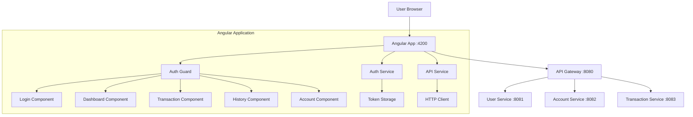
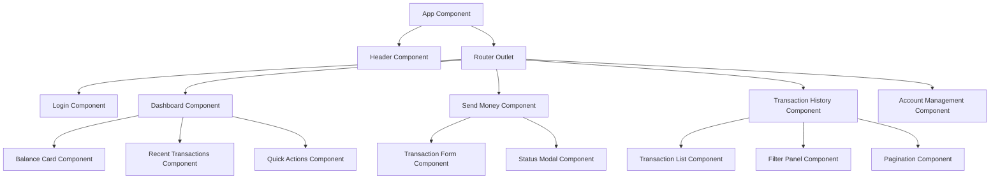

# UPI Angular Frontend Design Document

## Overview

The UPI Angular frontend is a modern, responsive web application built with Angular 17+ that provides a complete user interface for UPI operations. The application follows Angular best practices with standalone components, reactive forms, and state management using Angular services. It communicates with the backend microservices through the API Gateway and provides an intuitive, mobile-first user experience.

## Architecture

### Application Architecture Diagram



### Component Hierarchy



## Components and Interfaces

### 1. Core Application Structure

**App Component** (`app.component.ts`):
- Root component with navigation and routing
- Handles global loading states
- Manages authentication status display

**App Routing** (`app.routes.ts`):
```typescript
export const routes: Routes = [
  { path: '', redirectTo: '/dashboard', pathMatch: 'full' },
  { path: 'login', component: LoginComponent },
  { 
    path: 'dashboard', 
    component: DashboardComponent, 
    canActivate: [AuthGuard] 
  },
  { 
    path: 'send-money', 
    component: SendMoneyComponent, 
    canActivate: [AuthGuard] 
  },
  { 
    path: 'history', 
    component: TransactionHistoryComponent, 
    canActivate: [AuthGuard] 
  },
  { 
    path: 'account', 
    component: AccountManagementComponent, 
    canActivate: [AuthGuard] 
  },
  { path: '**', redirectTo: '/dashboard' }
];
```

### 2. Authentication System

**Auth Service** (`auth.service.ts`):
```typescript
@Injectable({ providedIn: 'root' })
export class AuthService {
  private currentUserSubject = new BehaviorSubject<User | null>(null);
  public currentUser$ = this.currentUserSubject.asObservable();
  
  login(credentials: LoginRequest): Observable<AuthResponse>
  logout(): void
  isAuthenticated(): boolean
  getToken(): string | null
  getCurrentUser(): User | null
}
```

**Auth Guard** (`auth.guard.ts`):
```typescript
export const authGuard: CanActivateFn = (route, state) => {
  const authService = inject(AuthService);
  const router = inject(Router);
  
  if (authService.isAuthenticated()) {
    return true;
  }
  
  router.navigate(['/login']);
  return false;
};
```

### 3. API Communication Layer

**API Service** (`api.service.ts`):
```typescript
@Injectable({ providedIn: 'root' })
export class ApiService {
  private baseUrl = 'http://localhost:8080/api';
  
  // User operations
  login(credentials: LoginRequest): Observable<AuthResponse>
  
  // Account operations
  getAccount(userId: number): Observable<Account>
  getAccountByUpiId(upiId: string): Observable<Account>
  getBalance(accountId: number): Observable<BalanceResponse>
  
  // Transaction operations
  sendMoney(request: TransferRequest): Observable<TransactionResponse>
  getTransactionHistory(userId: number): Observable<Transaction[]>
  getFilteredTransactions(userId: number, filter: TransactionFilter): Observable<Transaction[]>
}
```

**HTTP Interceptor** (`auth.interceptor.ts`):
```typescript
export const authInterceptor: HttpInterceptorFn = (req, next) => {
  const authService = inject(AuthService);
  const token = authService.getToken();
  
  if (token) {
    req = req.clone({
      setHeaders: {
        Authorization: `Bearer ${token}`
      }
    });
  }
  
  return next(req);
};
```

### 4. Feature Components

**Login Component** (`login.component.ts`):
- Reactive form with validation
- Handles authentication flow
- Displays error messages
- Redirects on successful login

**Dashboard Component** (`dashboard.component.ts`):
- Displays account summary
- Shows recent transactions
- Provides quick action buttons
- Real-time balance updates

**Send Money Component** (`send-money.component.ts`):
- Transaction form with validation
- UPI ID format validation
- Amount validation and limits
- Transaction status handling

**Transaction History Component** (`transaction-history.component.ts`):
- Paginated transaction list
- Date range filtering
- Search functionality
- Export capabilities

**Account Management Component** (`account-management.component.ts`):
- Account details display
- UPI ID copy functionality
- Balance refresh
- Account statistics

## Data Models

### TypeScript Interfaces

```typescript
// User and Authentication
export interface User {
  id: number;
  username: string;
  email: string;
  fullName: string;
}

export interface LoginRequest {
  username: string;
  password: string;
}

export interface AuthResponse {
  token: string;
  user: User;
  expiresIn: number;
}

// Account Management
export interface Account {
  id: number;
  userId: number;
  upiId: string;
  accountNumber: string;
  balance: number;
  createdAt: string;
  updatedAt: string;
}

export interface BalanceResponse {
  balance: number;
  upiId: string;
  lastUpdated: string;
}

// Transactions
export interface Transaction {
  id: number;
  senderUpiId: string;
  receiverUpiId: string;
  amount: number;
  description: string;
  status: TransactionStatus;
  transactionRef: string;
  createdAt: string;
}

export interface TransferRequest {
  senderUpiId: string;
  receiverUpiId: string;
  amount: number;
  description?: string;
}

export interface TransactionResponse {
  success: boolean;
  transactionRef: string;
  message: string;
  transaction?: Transaction;
}

export enum TransactionStatus {
  SUCCESS = 'SUCCESS',
  FAILED = 'FAILED',
  PENDING = 'PENDING'
}

// Filtering and Pagination
export interface TransactionFilter {
  startDate?: string;
  endDate?: string;
  minAmount?: number;
  maxAmount?: number;
  status?: TransactionStatus;
  searchTerm?: string;
}

export interface PaginationParams {
  page: number;
  size: number;
  sortBy?: string;
  sortDirection?: 'asc' | 'desc';
}
```

## State Management

### Service-Based State Management

**Account State Service** (`account-state.service.ts`):
```typescript
@Injectable({ providedIn: 'root' })
export class AccountStateService {
  private accountSubject = new BehaviorSubject<Account | null>(null);
  public account$ = this.accountSubject.asObservable();
  
  private balanceSubject = new BehaviorSubject<number>(0);
  public balance$ = this.balanceSubject.asObservable();
  
  loadAccount(userId: number): void
  updateBalance(newBalance: number): void
  refreshAccount(): void
}
```

**Transaction State Service** (`transaction-state.service.ts`):
```typescript
@Injectable({ providedIn: 'root' })
export class TransactionStateService {
  private recentTransactionsSubject = new BehaviorSubject<Transaction[]>([]);
  public recentTransactions$ = this.recentTransactionsSubject.asObservable();
  
  private transactionHistorySubject = new BehaviorSubject<Transaction[]>([]);
  public transactionHistory$ = this.transactionHistorySubject.asObservable();
  
  loadRecentTransactions(userId: number): void
  loadTransactionHistory(userId: number, filter?: TransactionFilter): void
  addNewTransaction(transaction: Transaction): void
}
```

## UI/UX Design

### Design System

**Color Palette**:
- Primary: #1976D2 (Blue)
- Secondary: #388E3C (Green)
- Success: #4CAF50
- Warning: #FF9800
- Error: #F44336
- Background: #FAFAFA
- Surface: #FFFFFF

**Typography**:
- Font Family: 'Roboto', sans-serif
- Headings: Material Design typography scale
- Body text: 14px regular for desktop

**Component Library**: Angular Material 17+
- Material Design components
- Consistent theming
- Accessibility compliance
- Desktop and tablet responsive breakpoints

### Responsive Design Breakpoints

```scss
$breakpoints: (
  tablet: 768px,
  desktop: 1024px,
  large: 1440px
);
```

### Layout Structure

**Desktop-First Approach**:
- Top navigation bar for desktop
- Sidebar navigation for larger screens
- Standard button sizes optimized for mouse interaction
- Keyboard navigation support

**Grid System**:
- CSS Grid for complex layouts
- Flexbox for component alignment
- Material Design spacing (8px grid)

## Error Handling

### Error Handling Strategy

**Global Error Handler** (`global-error.handler.ts`):
```typescript
@Injectable()
export class GlobalErrorHandler implements ErrorHandler {
  handleError(error: any): void {
    console.error('Global error:', error);
    
    if (error instanceof HttpErrorResponse) {
      this.handleHttpError(error);
    } else {
      this.handleClientError(error);
    }
  }
  
  private handleHttpError(error: HttpErrorResponse): void
  private handleClientError(error: Error): void
}
```

**Error Types and Handling**:
1. **Network Errors**: Retry mechanism with exponential backoff
2. **Authentication Errors**: Automatic logout and redirect to login
3. **Validation Errors**: Field-level error display
4. **Server Errors**: User-friendly error messages
5. **Timeout Errors**: Retry options for users

### User Feedback System

**Notification Service** (`notification.service.ts`):
```typescript
@Injectable({ providedIn: 'root' })
export class NotificationService {
  showSuccess(message: string): void
  showError(message: string): void
  showWarning(message: string): void
  showInfo(message: string): void
}
```

## Performance Optimization

### Loading Strategies

1. **Lazy Loading**: Feature modules loaded on demand
2. **OnPush Change Detection**: Optimized component updates
3. **Virtual Scrolling**: For large transaction lists
4. **Image Optimization**: WebP format with fallbacks
5. **Bundle Splitting**: Separate vendor and app bundles

### Caching Strategy

1. **HTTP Caching**: Cache account and transaction data
2. **Service Worker**: Offline functionality for critical features
3. **Local Storage**: User preferences and temporary data
4. **Memory Caching**: In-service data caching

## Testing Strategy

### Unit Testing
- Component testing with Angular Testing Utilities
- Service testing with dependency injection mocking
- Pipe and directive testing
- Form validation testing

### Integration Testing
- API service integration tests
- Component interaction tests
- Routing and navigation tests
- Authentication flow tests

### E2E Testing
- Complete user journey testing
- Cross-browser compatibility
- Mobile device testing
- Performance testing

## Security Considerations

### Frontend Security Measures

1. **Token Management**: Secure storage and automatic refresh
2. **Input Sanitization**: XSS prevention
3. **CSRF Protection**: Token-based protection
4. **Content Security Policy**: Strict CSP headers
5. **HTTPS Enforcement**: Secure communication only

### Data Protection

1. **Sensitive Data Handling**: No sensitive data in localStorage
2. **Session Management**: Automatic logout on inactivity
3. **Input Validation**: Client and server-side validation
4. **Error Information**: No sensitive data in error messages

## Development Environment Setup

### Prerequisites
- Node.js 18+
- Angular CLI 17+
- npm or yarn package manager

### Project Structure
```
src/
├── app/
│   ├── core/
│   │   ├── guards/
│   │   ├── interceptors/
│   │   └── services/
│   ├── shared/
│   │   ├── components/
│   │   ├── pipes/
│   │   └── models/
│   ├── features/
│   │   ├── auth/
│   │   ├── dashboard/
│   │   ├── transactions/
│   │   └── account/
│   └── app.component.ts
├── assets/
├── environments/
└── styles/
```

### Build Configuration

**Development**:
```json
{
  "serve": {
    "builder": "@angular-devkit/build-angular:dev-server",
    "options": {
      "port": 4200,
      "host": "localhost",
      "proxyConfig": "proxy.conf.json"
    }
  }
}
```

**Proxy Configuration** (`proxy.conf.json`):
```json
{
  "/api/*": {
    "target": "http://localhost:8080",
    "secure": false,
    "changeOrigin": true,
    "logLevel": "debug"
  }
}
```

This design provides a comprehensive foundation for your Angular UPI frontend that integrates seamlessly with your existing microservices backend while delivering a modern, responsive user experience.