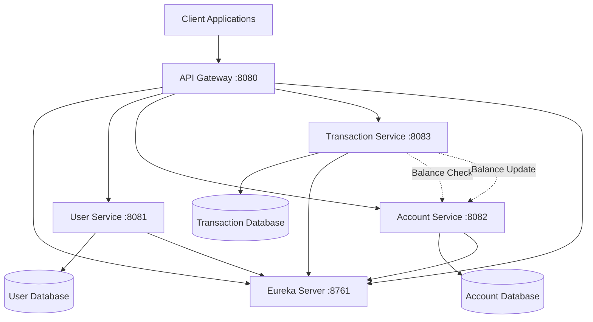

# UPI Microservices Design Document

## Overview

The UPI system will be implemented as a distributed microservices architecture using Spring Boot, with service discovery via Eureka Server and centralized routing through an API Gateway. The system consists of four main components: User Service (existing), Account Service, Transaction Service, and supporting infrastructure services.

## Architecture

### System Architecture Diagram



### Service Communication Flow

1. **Client Request**: All requests come through API Gateway
2. **Service Discovery**: Gateway discovers services via Eureka
3. **Request Routing**: Gateway routes to appropriate service
4. **Inter-service Communication**: Transaction Service calls Account Service for balance operations
5. **Database Operations**: Each service manages its own database

## Components and Interfaces

### 1. Eureka Server (Port: 8761)

**Purpose**: Service registry and discovery

**Configuration**:
- Spring Cloud Netflix Eureka Server
- Standalone mode (no clustering)
- Default dashboard enabled

**Key Properties**:
```yaml
server:
  port: 8761
eureka:
  client:
    register-with-eureka: false
    fetch-registry: false
```

### 2. API Gateway (Port: 8080)

**Purpose**: Central entry point and request routing

**Technology**: Spring Cloud Gateway

**Route Configuration**:
- `/api/users/**` → User Service
- `/api/accounts/**` → Account Service  
- `/api/transactions/**` → Transaction Service

**Features**:
- Load balancing via Eureka discovery
- Basic error handling
- Request/response logging

### 3. Account Service (Port: 8082)

**Purpose**: Manage user accounts and balances

**REST Endpoints**:
```
POST   /api/accounts              - Create account
GET    /api/accounts/{userId}     - Get account by user ID
GET    /api/accounts/upi/{upiId}  - Get account by UPI ID
PUT    /api/accounts/{id}/balance - Update balance
GET    /api/accounts/{id}/balance - Get current balance
```

**Database Schema**:
```sql
CREATE TABLE accounts (
    id BIGINT PRIMARY KEY AUTO_INCREMENT,
    user_id BIGINT NOT NULL,
    upi_id VARCHAR(100) UNIQUE NOT NULL,
    account_number VARCHAR(20) UNIQUE NOT NULL,
    balance DECIMAL(15,2) DEFAULT 0.00,
    created_at TIMESTAMP DEFAULT CURRENT_TIMESTAMP,
    updated_at TIMESTAMP DEFAULT CURRENT_TIMESTAMP ON UPDATE CURRENT_TIMESTAMP
);
```

### 4. Transaction Service (Port: 8083)

**Purpose**: Process payments and maintain transaction history

**REST Endpoints**:
```
POST   /api/transactions/transfer     - Process money transfer
GET    /api/transactions/user/{userId} - Get user transaction history
GET    /api/transactions/{id}         - Get transaction details
GET    /api/transactions/user/{userId}/filter - Get filtered transactions
```

**Database Schema**:
```sql
CREATE TABLE transactions (
    id BIGINT PRIMARY KEY AUTO_INCREMENT,
    sender_upi_id VARCHAR(100) NOT NULL,
    receiver_upi_id VARCHAR(100) NOT NULL,
    amount DECIMAL(15,2) NOT NULL,
    description VARCHAR(255),
    status VARCHAR(20) NOT NULL,
    transaction_ref VARCHAR(50) UNIQUE NOT NULL,
    created_at TIMESTAMP DEFAULT CURRENT_TIMESTAMP
);
```

## Data Models

### Account Entity
```java
@Entity
public class Account {
    @Id
    @GeneratedValue(strategy = GenerationType.IDENTITY)
    private Long id;
    
    @Column(nullable = false)
    private Long userId;
    
    @Column(unique = true, nullable = false)
    private String upiId;
    
    @Column(unique = true, nullable = false)
    private String accountNumber;
    
    @Column(precision = 15, scale = 2)
    private BigDecimal balance = BigDecimal.ZERO;
    
    private LocalDateTime createdAt;
    private LocalDateTime updatedAt;
}
```

### Transaction Entity
```java
@Entity
public class Transaction {
    @Id
    @GeneratedValue(strategy = GenerationType.IDENTITY)
    private Long id;
    
    @Column(nullable = false)
    private String senderUpiId;
    
    @Column(nullable = false)
    private String receiverUpiId;
    
    @Column(precision = 15, scale = 2, nullable = false)
    private BigDecimal amount;
    
    private String description;
    
    @Enumerated(EnumType.STRING)
    private TransactionStatus status;
    
    @Column(unique = true, nullable = false)
    private String transactionRef;
    
    private LocalDateTime createdAt;
}
```

### DTOs and Request/Response Models

**Transfer Request**:
```java
public class TransferRequest {
    private String senderUpiId;
    private String receiverUpiId;
    private BigDecimal amount;
    private String description;
}
```

**Account Creation Request**:
```java
public class CreateAccountRequest {
    private Long userId;
    private BigDecimal initialBalance;
}
```

## Error Handling

### Standard Error Response Format
```java
public class ErrorResponse {
    private String error;
    private String message;
    private int status;
    private LocalDateTime timestamp;
}
```

### Error Scenarios

1. **Insufficient Balance**: HTTP 400 with specific error message
2. **Invalid UPI ID**: HTTP 404 when UPI ID not found
3. **Service Unavailable**: HTTP 503 when downstream service is down
4. **Duplicate Account**: HTTP 409 when trying to create duplicate account
5. **Invalid Amount**: HTTP 400 for negative or zero amounts

### Global Exception Handling

Each service will implement `@ControllerAdvice` for consistent error handling:
- `InsufficientBalanceException`
- `AccountNotFoundException`
- `InvalidTransactionException`
- `ServiceUnavailableException`

## Inter-Service Communication

### Account Service APIs for Transaction Service

**Balance Check**:
```
GET /api/accounts/upi/{upiId}/balance
Response: { "balance": 1000.00, "upiId": "user@bank" }
```

**Balance Update**:
```
PUT /api/accounts/upi/{upiId}/balance
Body: { "amount": -500.00, "operation": "DEBIT" }
```

### Communication Pattern

1. **Synchronous REST calls** using `RestTemplate` or `WebClient`
2. **Circuit breaker pattern** for resilience (optional enhancement)
3. **Retry mechanism** for transient failures
4. **Timeout configuration** for all inter-service calls

## Testing Strategy

### Unit Testing
- Service layer business logic testing
- Repository layer data access testing
- Controller layer endpoint testing
- Mock external dependencies

### Integration Testing
- Database integration tests using `@DataJpaTest`
- Web layer tests using `@WebMvcTest`
- Full application context tests using `@SpringBootTest`

### Contract Testing
- API contract validation between services
- Schema validation for request/response models

### End-to-End Testing
- Complete transaction flow testing
- Service discovery and routing validation
- Error scenario testing

## Configuration Management

### Application Properties Structure

**Eureka Server** (`application.yml`):
```yaml
server:
  port: 8761
spring:
  application:
    name: eureka-server
eureka:
  client:
    register-with-eureka: false
    fetch-registry: false
```

**API Gateway** (`application.yml`):
```yaml
server:
  port: 8080
spring:
  application:
    name: api-gateway
  cloud:
    gateway:
      discovery:
        locator:
          enabled: true
eureka:
  client:
    service-url:
      defaultZone: http://localhost:8761/eureka
```

**Account Service** (`application.yml`):
```yaml
server:
  port: 8082
spring:
  application:
    name: account-service
  datasource:
    url: jdbc:h2:mem:accountdb
    driver-class-name: org.h2.Driver
  jpa:
    hibernate:
      ddl-auto: create-drop
eureka:
  client:
    service-url:
      defaultZone: http://localhost:8761/eureka
```

**Transaction Service** (`application.yml`):
```yaml
server:
  port: 8083
spring:
  application:
    name: transaction-service
  datasource:
    url: jdbc:h2:mem:transactiondb
    driver-class-name: org.h2.Driver
  jpa:
    hibernate:
      ddl-auto: create-drop
eureka:
  client:
    service-url:
      defaultZone: http://localhost:8761/eureka
```

## Deployment and Startup Sequence

### Startup Order
1. **Eureka Server** (8761) - Start first
2. **Account Service** (8082) - Register with Eureka
3. **Transaction Service** (8083) - Register with Eureka  
4. **API Gateway** (8080) - Start after services are registered
5. **User Service** (8081) - Can start anytime after Eureka

### Development Environment
- All services run locally on different ports
- H2 in-memory databases for development
- Eureka dashboard available at `http://localhost:8761`
- API Gateway routes all requests from `http://localhost:8080`

This design provides a solid foundation for your UPI implementation with clear separation of concerns, proper service communication, and scalable architecture patterns.