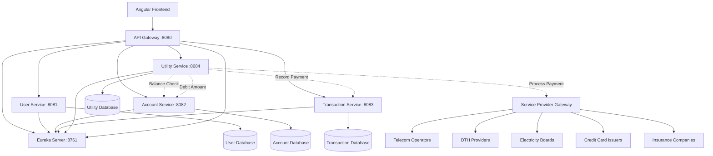

# Utility Payment Services Design Document

## Overview

The Utility Payment Services feature extends the existing UPI payment system to support various utility bill payments and recharges similar to PhonePe. This design integrates seamlessly with the current microservices architecture, adding a new Utility Service that orchestrates payments to external service providers while leveraging the existing Account Service for balance management and Transaction Service for payment recording.

The system will support multiple payment categories including mobile recharge, DTH recharge, electricity bill payment, credit card bill payment, and insurance premium payment through a unified interface.

## Architecture

### High-Level Architecture Diagram



### Service Integration Flow

The Utility Service acts as an orchestrator that:
1. Validates user account and balance via Account Service
2. Processes payment with external service providers
3. Records transaction via Transaction Service
4. Manages utility-specific data (saved billers, payment history)

## Components and Interfaces

### 1. Utility Service (Port: 8084)

**Purpose**: Orchestrate utility payments and manage service provider integrations

**REST Endpoints**:
```
# Payment Categories
GET    /api/utilities/categories                    - Get all payment categories

# Mobile Recharge
POST   /api/utilities/recharge/mobile              - Process mobile recharge
GET    /api/utilities/recharge/mobile/operators    - Get mobile operators
GET    /api/utilities/recharge/mobile/plans/{operator}  - Get recharge plans

# DTH Recharge
POST   /api/utilities/recharge/dth                 - Process DTH recharge
GET    /api/utilities/recharge/dth/operators       - Get DTH operators
GET    /api/utilities/recharge/dth/plans/{operator}/{subscriberId}  - Get DTH plans

# Bill Payments
POST   /api/utilities/bills/electricity            - Pay electricity bill
POST   /api/utilities/bills/credit-card            - Pay credit card bill
POST   /api/utilities/bills/insurance              - Pay insurance premium
GET    /api/utilities/bills/electricity/providers  - Get electricity providers
GET    /api/utilities/bills/electricity/fetch      - Fetch bill details
GET    /api/utilities/bills/credit-card/issuers    - Get credit card issuers

# Saved Billers
POST   /api/utilities/billers                      - Save biller
GET    /api/utilities/billers/{userId}             - Get user's saved billers
GET    /api/utilities/billers/{userId}/{category}  - Get billers by category
PUT    /api/utilities/billers/{id}                 - Update biller
DELETE /api/utilities/billers/{id}                 - Delete biller

# Payment History
GET    /api/utilities/payments/{userId}            - Get user's utility payments
GET    /api/utilities/payments/{userId}/{category} - Get payments by category
GET    /api/utilities/payments/transaction/{id}    - Get payment details
POST   /api/utilities/payments/{id}/receipt        - Generate payment receipt

# Service Provider Management (Admin)
POST   /api/utilities/admin/providers              - Add service provider
GET    /api/utilities/admin/providers              - Get all providers
PUT    /api/utilities/admin/providers/{id}         - Update provider
PUT    /api/utilities/admin/providers/{id}/status  - Enable/disable provider
```

**Database Schema**:
```sql
-- Payment Categories
CREATE TABLE payment_categories (
    id BIGINT PRIMARY KEY AUTO_INCREMENT,
    name VARCHAR(50) NOT NULL UNIQUE,
    display_name VARCHAR(100) NOT NULL,
    icon_url VARCHAR(255),
    is_active BOOLEAN DEFAULT TRUE,
    created_at TIMESTAMP DEFAULT CURRENT_TIMESTAMP
);

-- Service Providers
CREATE TABLE service_providers (
    id BIGINT PRIMARY KEY AUTO_INCREMENT,
    category_id BIGINT NOT NULL,
    provider_name VARCHAR(100) NOT NULL,
    provider_code VARCHAR(50) NOT NULL UNIQUE,
    api_endpoint VARCHAR(255),
    api_key_encrypted VARCHAR(500),
    is_active BOOLEAN DEFAULT TRUE,
    created_at TIMESTAMP DEFAULT CURRENT_TIMESTAMP,
    updated_at TIMESTAMP DEFAULT CURRENT_TIMESTAMP ON UPDATE CURRENT_TIMESTAMP,
    FOREIGN KEY (category_id) REFERENCES payment_categories(id)
);

-- Utility Payments
CREATE TABLE utility_payments (
    id BIGINT PRIMARY KEY AUTO_INCREMENT,
    user_id BIGINT NOT NULL,
    upi_id VARCHAR(100) NOT NULL,
    category_id BIGINT NOT NULL,
    provider_id BIGINT NOT NULL,
    account_identifier VARCHAR(100) NOT NULL,
    amount DECIMAL(15,2) NOT NULL,
    payment_status VARCHAR(20) NOT NULL,
    transaction_ref VARCHAR(50) UNIQUE NOT NULL,
    provider_transaction_ref VARCHAR(100),
    payment_details JSON,
    created_at TIMESTAMP DEFAULT CURRENT_TIMESTAMP,
    completed_at TIMESTAMP,
    FOREIGN KEY (category_id) REFERENCES payment_categories(id),
    FOREIGN KEY (provider_id) REFERENCES service_providers(id),
    INDEX idx_user_payments (user_id, created_at),
    INDEX idx_transaction_ref (transaction_ref)
);

-- Saved Billers
CREATE TABLE saved_billers (
    id BIGINT PRIMARY KEY AUTO_INCREMENT,
    user_id BIGINT NOT NULL,
    category_id BIGINT NOT NULL,
    provider_id BIGINT NOT NULL,
    account_identifier VARCHAR(100) NOT NULL,
    nickname VARCHAR(100),
    account_holder_name VARCHAR(100),
    created_at TIMESTAMP DEFAULT CURRENT_TIMESTAMP,
    updated_at TIMESTAMP DEFAULT CURRENT_TIMESTAMP ON UPDATE CURRENT_TIMESTAMP,
    FOREIGN KEY (category_id) REFERENCES payment_categories(id),
    FOREIGN KEY (provider_id) REFERENCES service_providers(id),
    UNIQUE KEY unique_user_biller (user_id, category_id, provider_id, account_identifier)
);

-- Recharge Plans (cached from providers)
CREATE TABLE recharge_plans (
    id BIGINT PRIMARY KEY AUTO_INCREMENT,
    provider_id BIGINT NOT NULL,
    plan_code VARCHAR(50) NOT NULL,
    plan_name VARCHAR(100) NOT NULL,
    amount DECIMAL(15,2) NOT NULL,
    validity_days INT,
    description TEXT,
    is_active BOOLEAN DEFAULT TRUE,
    created_at TIMESTAMP DEFAULT CURRENT_TIMESTAMP,
    updated_at TIMESTAMP DEFAULT CURRENT_TIMESTAMP ON UPDATE CURRENT_TIMESTAMP,
    FOREIGN KEY (provider_id) REFERENCES service_providers(id),
    UNIQUE KEY unique_provider_plan (provider_id, plan_code)
);
```

### 2. Service Provider Gateway Component

**Purpose**: Abstract external service provider integrations

**Interface**:
```java
public interface ServiceProviderGateway {
    // Mobile Recharge
    RechargeResponse processMobileRecharge(MobileRechargeRequest request);
    List<RechargePlan> getMobileRechargePlans(String operatorCode);
    
    // DTH Recharge
    RechargeResponse processDTHRecharge(DTHRechargeRequest request);
    List<RechargePlan> getDTHRechargePlans(String operatorCode, String subscriberId);
    
    // Bill Payments
    BillDetails fetchElectricityBill(String providerCode, String consumerNumber);
    PaymentResponse payElectricityBill(ElectricityBillPaymentRequest request);
    PaymentResponse payCreditCardBill(CreditCardPaymentRequest request);
    PaymentResponse payInsurancePremium(InsurancePremiumRequest request);
    
    // Provider Management
    boolean validateProvider(String providerCode);
    ProviderStatus getProviderStatus(String providerCode);
}
```

**Implementation Strategy**:
- **Adapter Pattern**: Each provider type has a specific adapter
- **Mock Implementation**: For development/testing without real provider APIs
- **Real Implementation**: Integrates with actual provider APIs
- **Fallback Mechanism**: Graceful handling of provider unavailability

### 3. Payment Orchestration Service

**Purpose**: Coordinate the payment flow across multiple services

**Payment Flow Logic**:
```java
@Service
public class PaymentOrchestrationService {
    
    @Transactional
    public UtilityPaymentResponse processUtilityPayment(UtilityPaymentRequest request) {
        // Step 1: Validate user account
        AccountResponse account = accountServiceClient.getAccountByUpiId(request.getUpiId());
        
        // Step 2: Check balance
        BalanceResponse balance = accountServiceClient.getBalance(request.getUpiId());
        if (balance.getBalance().compareTo(request.getAmount()) < 0) {
            throw new InsufficientBalanceException("Insufficient balance");
        }
        
        // Step 3: Validate service provider
        ServiceProvider provider = serviceProviderRepository.findByCode(request.getProviderCode());
        if (!provider.isActive()) {
            throw new ProviderUnavailableException("Service provider unavailable");
        }
        
        // Step 4: Create pending payment record
        UtilityPayment payment = createPendingPayment(request);
        
        try {
            // Step 5: Debit user account
            accountServiceClient.updateBalance(
                request.getUpiId(), 
                request.getAmount().negate(), 
                "DEBIT"
            );
            
            // Step 6: Process payment with provider
            PaymentResponse providerResponse = serviceProviderGateway.processPayment(
                provider.getProviderCode(),
                request
            );
            
            // Step 7: Update payment status
            payment.setPaymentStatus("COMPLETED");
            payment.setProviderTransactionRef(providerResponse.getTransactionRef());
            payment.setCompletedAt(LocalDateTime.now());
            utilityPaymentRepository.save(payment);
            
            // Step 8: Record in transaction service
            transactionServiceClient.recordUtilityPayment(
                request.getUpiId(),
                provider.getProviderName(),
                request.getAmount(),
                payment.getTransactionRef()
            );
            
            return buildSuccessResponse(payment, providerResponse);
            
        } catch (Exception e) {
            // Rollback: Refund amount if deducted
            handlePaymentFailure(payment, request.getUpiId(), request.getAmount());
            throw new PaymentProcessingException("Payment failed", e);
        }
    }
}
```

## Data Models

### Core Entities

#### UtilityPayment Entity
```java
@Entity
@Table(name = "utility_payments")
public class UtilityPayment {
    @Id
    @GeneratedValue(strategy = GenerationType.IDENTITY)
    private Long id;
    
    @Column(nullable = false)
    private Long userId;
    
    @Column(nullable = false)
    private String upiId;
    
    @ManyToOne
    @JoinColumn(name = "category_id", nullable = false)
    private PaymentCategory category;
    
    @ManyToOne
    @JoinColumn(name = "provider_id", nullable = false)
    private ServiceProvider provider;
    
    @Column(nullable = false)
    private String accountIdentifier;
    
    @Column(precision = 15, scale = 2, nullable = false)
    private BigDecimal amount;
    
    @Enumerated(EnumType.STRING)
    @Column(nullable = false)
    private PaymentStatus paymentStatus;
    
    @Column(unique = true, nullable = false)
    private String transactionRef;
    
    private String providerTransactionRef;
    
    @Column(columnDefinition = "JSON")
    private String paymentDetails;
    
    private LocalDateTime createdAt;
    private LocalDateTime completedAt;
}
```

#### SavedBiller Entity
```java
@Entity
@Table(name = "saved_billers")
public class SavedBiller {
    @Id
    @GeneratedValue(strategy = GenerationType.IDENTITY)
    private Long id;
    
    @Column(nullable = false)
    private Long userId;
    
    @ManyToOne
    @JoinColumn(name = "category_id", nullable = false)
    private PaymentCategory category;
    
    @ManyToOne
    @JoinColumn(name = "provider_id", nullable = false)
    private ServiceProvider provider;
    
    @Column(nullable = false)
    private String accountIdentifier;
    
    private String nickname;
    private String accountHolderName;
    
    private LocalDateTime createdAt;
    private LocalDateTime updatedAt;
}
```

#### ServiceProvider Entity
```java
@Entity
@Table(name = "service_providers")
public class ServiceProvider {
    @Id
    @GeneratedValue(strategy = GenerationType.IDENTITY)
    private Long id;
    
    @ManyToOne
    @JoinColumn(name = "category_id", nullable = false)
    private PaymentCategory category;
    
    @Column(nullable = false)
    private String providerName;
    
    @Column(unique = true, nullable = false)
    private String providerCode;
    
    private String apiEndpoint;
    private String apiKeyEncrypted;
    
    @Column(nullable = false)
    private Boolean isActive = true;
    
    private LocalDateTime createdAt;
    private LocalDateTime updatedAt;
}
```

### DTOs and Request/Response Models

#### Mobile Recharge Request
```java
public class MobileRechargeRequest {
    private String upiId;
    private String mobileNumber;
    private String operatorCode;
    private BigDecimal amount;
    private String planCode;
}
```

#### Electricity Bill Payment Request
```java
public class ElectricityBillPaymentRequest {
    private String upiId;
    private String providerCode;
    private String consumerNumber;
    private BigDecimal amount;
    private String billingCycle;
}
```

#### Bill Details Response
```java
public class BillDetails {
    private String consumerNumber;
    private String consumerName;
    private BigDecimal amountDue;
    private LocalDate dueDate;
    private String billingPeriod;
    private Map<String, Object> additionalDetails;
}
```

#### Payment Response
```java
public class UtilityPaymentResponse {
    private String transactionRef;
    private String providerTransactionRef;
    private PaymentStatus status;
    private BigDecimal amount;
    private String message;
    private LocalDateTime timestamp;
    private Map<String, Object> receiptDetails;
}
```

## Error Handling

### Error Response Format
```java
public class UtilityErrorResponse {
    private String error;
    private String message;
    private int status;
    private String transactionRef;
    private LocalDateTime timestamp;
    private Map<String, String> details;
}
```

### Error Scenarios

1. **Insufficient Balance**: HTTP 400
   - Check balance before payment initiation
   - Clear error message with current balance

2. **Invalid Account Identifier**: HTTP 400
   - Validate format before provider call
   - Provider-specific validation rules

3. **Provider Unavailable**: HTTP 503
   - Retry mechanism with exponential backoff
   - Fallback to alternative providers if available

4. **Payment Processing Failed**: HTTP 500
   - Automatic refund if amount deducted
   - Transaction marked as FAILED with reason

5. **Duplicate Transaction**: HTTP 409
   - Check for duplicate transaction refs
   - Idempotency key validation

6. **Bill Not Found**: HTTP 404
   - Invalid consumer number or provider code
   - Suggest validation steps

### Global Exception Handling

```java
@ControllerAdvice
public class UtilityExceptionHandler {
    
    @ExceptionHandler(InsufficientBalanceException.class)
    public ResponseEntity<UtilityErrorResponse> handleInsufficientBalance(
            InsufficientBalanceException ex) {
        return ResponseEntity.status(HttpStatus.BAD_REQUEST)
                .body(buildErrorResponse(ex, "INSUFFICIENT_BALANCE"));
    }
    
    @ExceptionHandler(ProviderUnavailableException.class)
    public ResponseEntity<UtilityErrorResponse> handleProviderUnavailable(
            ProviderUnavailableException ex) {
        return ResponseEntity.status(HttpStatus.SERVICE_UNAVAILABLE)
                .body(buildErrorResponse(ex, "PROVIDER_UNAVAILABLE"));
    }
    
    @ExceptionHandler(PaymentProcessingException.class)
    public ResponseEntity<UtilityErrorResponse> handlePaymentProcessing(
            PaymentProcessingException ex) {
        return ResponseEntity.status(HttpStatus.INTERNAL_SERVER_ERROR)
                .body(buildErrorResponse(ex, "PAYMENT_FAILED"));
    }
}
```

## Inter-Service Communication

### Utility Service → Account Service

**Balance Check**:
```java
public Mono<BalanceResponse> checkBalance(String upiId) {
    return webClient.get()
            .uri("http://account-service/api/accounts/upi/{upiId}/balance", upiId)
            .retrieve()
            .bodyToMono(BalanceResponse.class)
            .timeout(Duration.ofMillis(3000));
}
```

**Balance Debit**:
```java
public Mono<BalanceResponse> debitAmount(String upiId, BigDecimal amount) {
    BalanceUpdateRequest request = new BalanceUpdateRequest(amount.negate(), "DEBIT");
    return webClient.put()
            .uri("http://account-service/api/accounts/upi/{upiId}/balance", upiId)
            .bodyValue(request)
            .retrieve()
            .bodyToMono(BalanceResponse.class)
            .timeout(Duration.ofMillis(5000))
            .retryWhen(Retry.backoff(2, Duration.ofSeconds(1)));
}
```

### Utility Service → Transaction Service

**Record Payment**:
```java
public Mono<TransactionResponse> recordUtilityPayment(UtilityPaymentRecord record) {
    return webClient.post()
            .uri("http://transaction-service/api/transactions/utility")
            .bodyValue(record)
            .retrieve()
            .bodyToMono(TransactionResponse.class)
            .timeout(Duration.ofMillis(5000));
}
```

### Communication Pattern

1. **Synchronous for Critical Operations**: Balance checks and debits
2. **Asynchronous for Non-Critical**: Transaction recording, notifications
3. **Retry with Backoff**: Transient failure handling
4. **Circuit Breaker**: Prevent cascade failures
5. **Timeout Configuration**: All calls have explicit timeouts

## Testing Strategy

### Unit Testing
- Service layer business logic (payment orchestration)
- Repository layer data access
- Controller layer endpoint validation
- Provider gateway adapters
- Mock external provider APIs

### Integration Testing
- Database integration with H2
- Inter-service communication with WireMock
- End-to-end payment flows
- Error scenario testing

### Contract Testing
- API contract validation with Account Service
- API contract validation with Transaction Service
- Provider gateway interface contracts

### Performance Testing
- Load testing for concurrent payments
- Stress testing for provider failures
- Response time validation (target: <500ms)

## Configuration Management

### Application Properties

```yaml
server:
  port: 8084

spring:
  application:
    name: utility-service
  datasource:
    url: jdbc:h2:mem:utilitydb
    driver-class-name: org.h2.Driver
    username: sa
    password: password
  jpa:
    hibernate:
      ddl-auto: create-drop
    show-sql: true

eureka:
  client:
    service-url:
      defaultZone: http://localhost:8761/eureka/
    fetch-registry: true
    register-with-eureka: true
  instance:
    prefer-ip-address: true
    lease-renewal-interval-in-seconds: 30

# Service Dependencies
account-service:
  base-url: http://account-service
  timeout: 5000
  max-retries: 3

transaction-service:
  base-url: http://transaction-service
  timeout: 5000
  max-retries: 2

# Provider Gateway Configuration
provider-gateway:
  timeout: 10000
  max-retries: 2
  retry-delay: 2000
  mock-mode: true  # Use mock providers for development

logging:
  level:
    com.upi.utility: DEBUG
    org.springframework.web: INFO
```

### API Gateway Route Configuration

```yaml
spring:
  cloud:
    gateway:
      routes:
        - id: utility-service
          uri: lb://utility-service
          predicates:
            - Path=/api/utilities/**
```

## Security Considerations

### Data Protection
- Encrypt service provider API keys in database
- Mask sensitive account identifiers in logs
- Secure communication with HTTPS in production

### Transaction Security
- Generate unique transaction references
- Implement idempotency for payment requests
- Validate all inputs before processing

### Provider Integration Security
- API key rotation mechanism
- Rate limiting for provider calls
- IP whitelisting for provider callbacks

## Deployment and Startup

### Startup Order
1. Eureka Server (8761)
2. Account Service (8082)
3. Transaction Service (8083)
4. **Utility Service (8084)** - New service
5. API Gateway (8080)

### Development Environment
- H2 in-memory database for development
- Mock provider gateway for testing
- Eureka registration on startup
- All routes accessible via API Gateway

This design provides a comprehensive foundation for implementing utility payment services that integrates seamlessly with your existing UPI microservices architecture while maintaining scalability, reliability, and maintainability.
